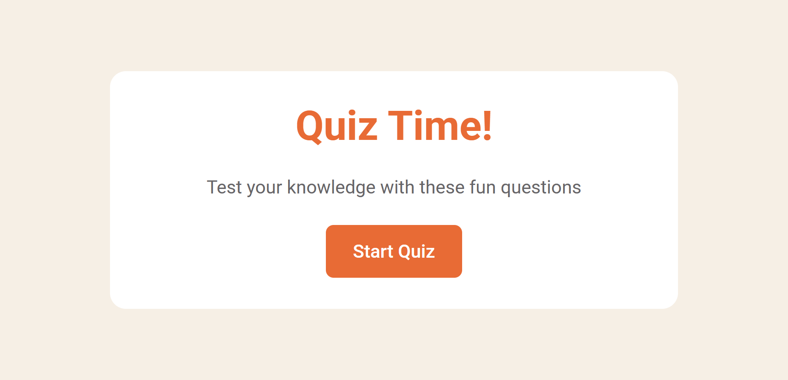

# 🎯 QuizSpark

**QuizSpark** is a responsive, accessible, and interactive quiz web app built with HTML, CSS, and JavaScript. It fetches trivia questions from the [Open Trivia Database (OpenTDB)](https://opentdb.com/) and presents them in a clean, mobile-first UI. This project was designed for fun, learning, and practicing modern web development techniques.

---

## 📸 Screenshots

---

## 🚀 Features

- ✅ Responsive design (mobile, tablet, desktop)
- ✅ Accessible answer buttons (keyboard + screen reader support)
- ✅ Dynamic progress tracking with styled range input
- ✅ Audio feedback for correct, incorrect, and final answers
- ✅ Smooth transitions between sections
- ✅ Reset functionality to replay the quiz
- ✅ Questions fetched from [OpenTDB API](https://opentdb.com/)

---

## 🧠 How It Works

1. **Start Page**: A welcome message and a button to start the quiz.
2. **Question Page**:
   - 5 multiple-choice animal-related questions are fetched via OpenTDB.
   - User selects an answer; correct/incorrect feedback is shown.
   - Score increases by 5 points per correct answer.
   - A progress bar visually tracks quiz completion.
3. **Results Page**: The total correct answers and final score are displayed, with an option to restart the quiz.

---

## 🛠️ Technologies Used

- **HTML5** — Semantic markup and structure
- **CSS3** — Custom properties (variables), media queries, transitions
- **JavaScript (ES6)** — Dynamic DOM manipulation, generators, async/await
- **Google Fonts** — Roboto family
- **Audio API** — For sound feedback
- **[OpenTDB API](https://opentdb.com/api_config.php)** — For real-time trivia data
